<head></head>
<body>
<h1 align="center">Sistem Inventory stok Laravel 6</h1>

Laravel merupakan salah satu framework aplikasi web opensource dengan basis utama bahasa PHP. Keuntungan menggunakan laravel salah satunya adalah banyaknya package/library yang tersedia, selain itu dukungan komunitasnya besar.

Saya mencoba mencoba membuat project laravel dengan tema sistem inventory stock, dimana tujuannya untuk memonitoring jumlah produk masuk, produk keluar dan produk yang masih tersimpan. Selain itu dapat membuat invoice produk masuk dan produk keluarnya. Berikut deskripsi project tersebut

<h3>Sofware yang digunakan</h3>
<ul>
    <li>XAMPP for Linux 7.4.2-64bit(PHP 7.4.2,PhpMyAdmin 5.0.1)</li>
    <li>OS Ubuntu 18.04.3 LTS</li>
    <li>Firefox 68.0.1 64 bit</li>
    <li>Laravel 6.2</li>
    <li>Composer 1.9.3</li>
</ul>

<h3>Package laravel yang dibutuhkan</h3>
<ul>
    <li>Yajra/laravel-datatables-oracle: 9.7</li>
    <li>Maatwebsite/excel: 3.1</li>
    <li>Barryvdh/laravel-dompdf: 0.8.5</li>
</ul>

<h3>Fitur yang tersedia</h3>

<table border="1px">
    <thead>
        <th>Menu</th>
        <th>CRUD</th>
        <th>Export Excel</th>
        <th>Import Excel</th>
        <th>Export PDF</th>
        <th>Export Invoice PDF</th>
    </thead>
    <tbody>
        <tr>
            <td>Supplier</td>
            <td>Ada</td>
            <td>Ada</td>
            <td>Ada</td>
            <td>Ada</td>
            <td></td>
        </tr>
        <tr>
            <td>Pelanggan</td>
            <td>Ada</td>
            <td>Ada</td>
            <td>Ada</td>
            <td>Ada</td>
            <td></td>
        </tr>
        <tr>
            <td>Penjual</td>
            <td>Ada</td>
            <td>Ada</td>
            <td>Ada</td>
            <td>Ada</td>
            <td></td>
        </tr>
        <tr>
            <td>Kategori</td>
            <td>Ada</td>
            <td>Ada</td>
            <td>Ada</td>
            <td>Ada</td>
            <td></td>
        </tr>
        <tr>
            <td>Produk</td>
            <td>Ada</td>
            <td>Ada</td>
            <td>Ada</td>
            <td>Ada</td>
            <td></td>
        </tr>
        <tr>
            <td>Produk Masuk</td>
            <td>Ada</td>
            <td>Ada</td>
            <td>Ada</td>
            <td>Ada</td>
            <td>Ada</td>
        </tr>
        <tr>
            <td>Produk Keluar</td>
            <td>Ada</td>
            <td>Ada</td>
            <td>Ada</td>
            <td>Ada</td>
            <td>Ada</td>
        </tr>
    </tbody>
</table>

<h3>Preview design layout</h3>
<ul>
    <li>Halaman Login</li>
     
    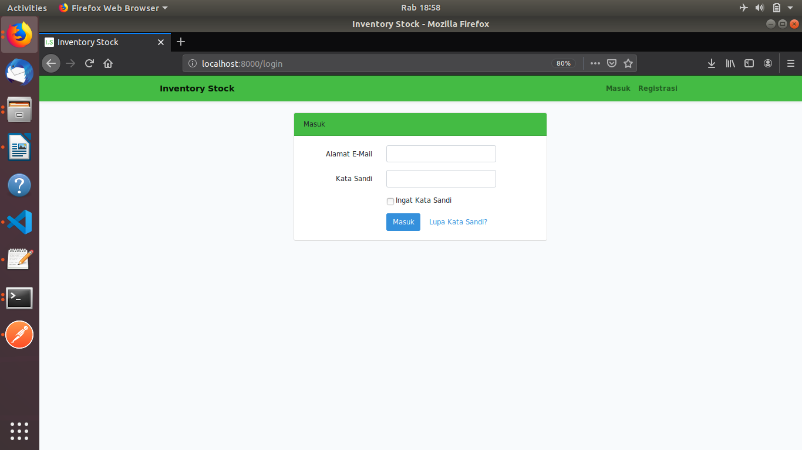
      
    <li>Halaman Register</li>
     
    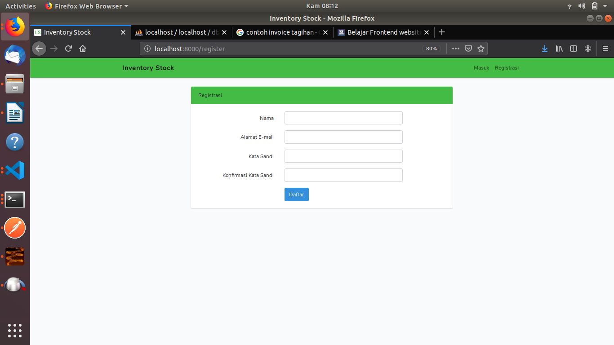
      
    <li>Halaman Utama</li>
     
    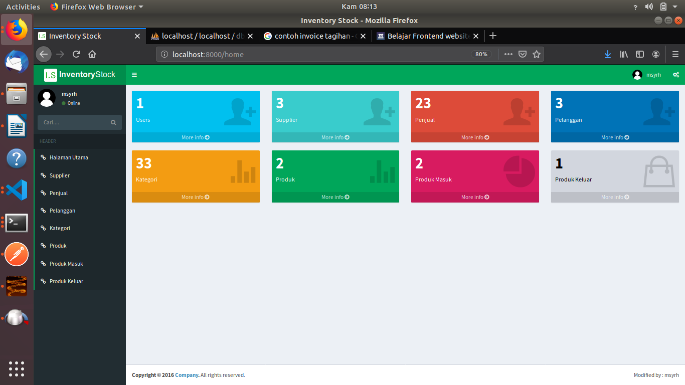
      
    <li>Halaman Data Kategori</li>
     
    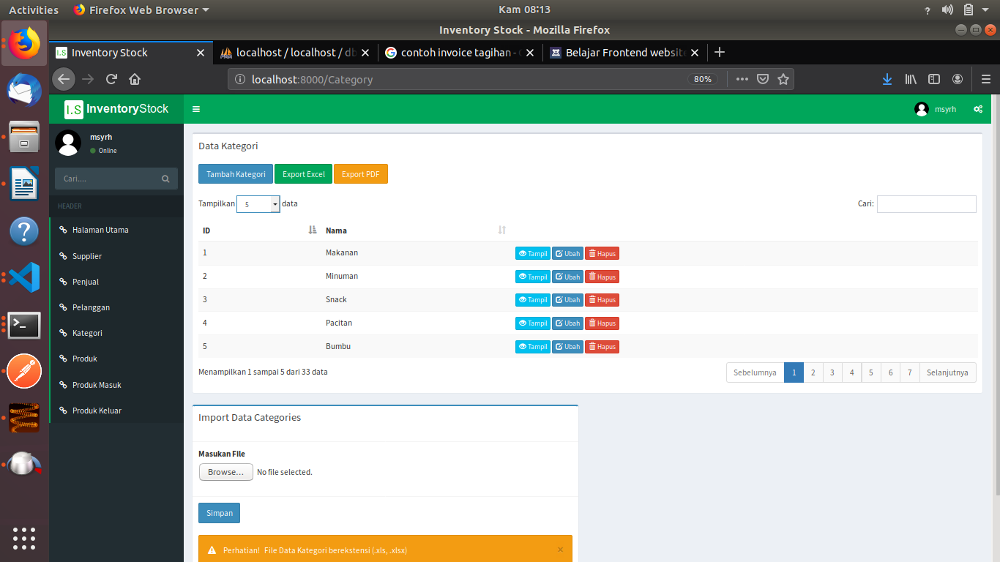
      
    <li>Halaman Tambah Data Kategori</li>
     
    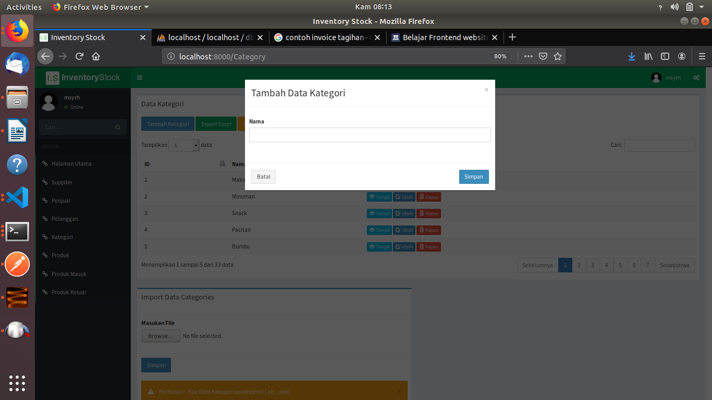
      
    <li>Halaman Ubah Data Kategori</li>
     
    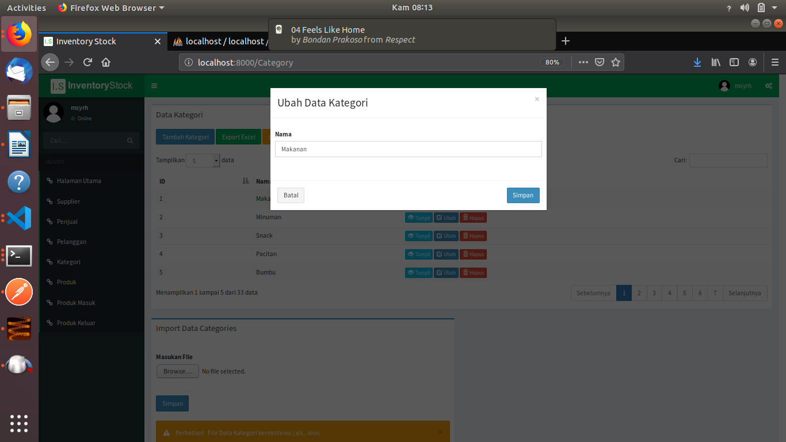
      
    <li>Halaman Hapus Data Kategori</li>
     
    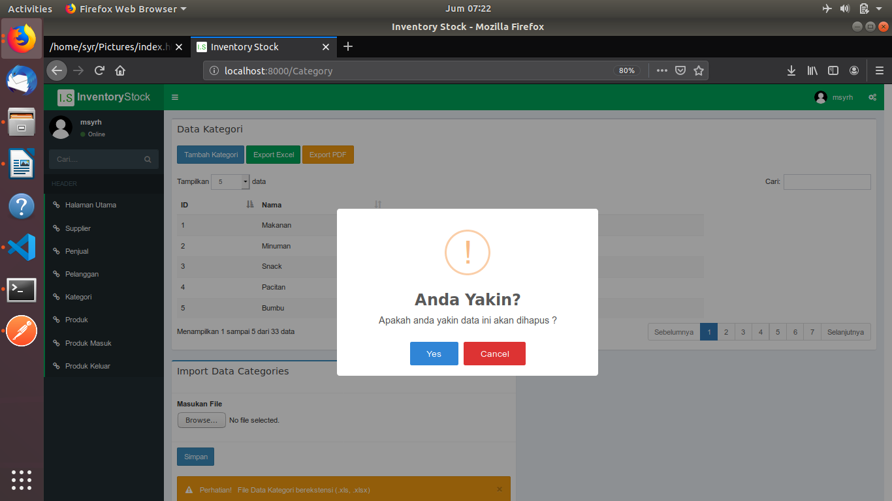
      
    <li>Halaman Data Produk</li>
     
    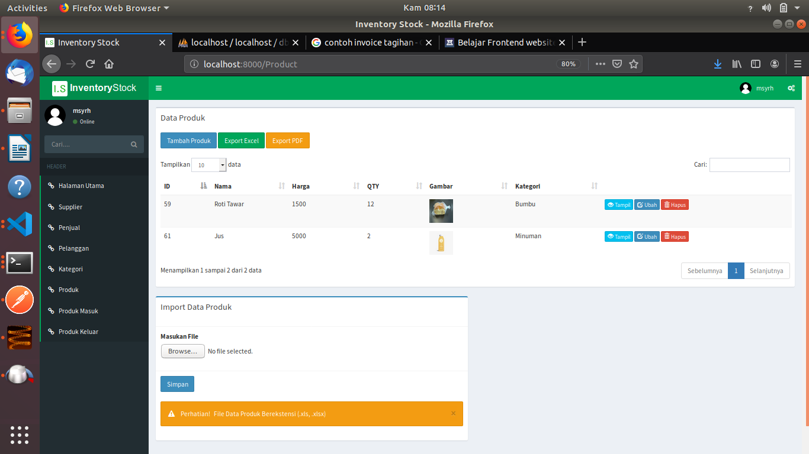
      
    <li>Halaman Tambah Data Produk</li>
     
    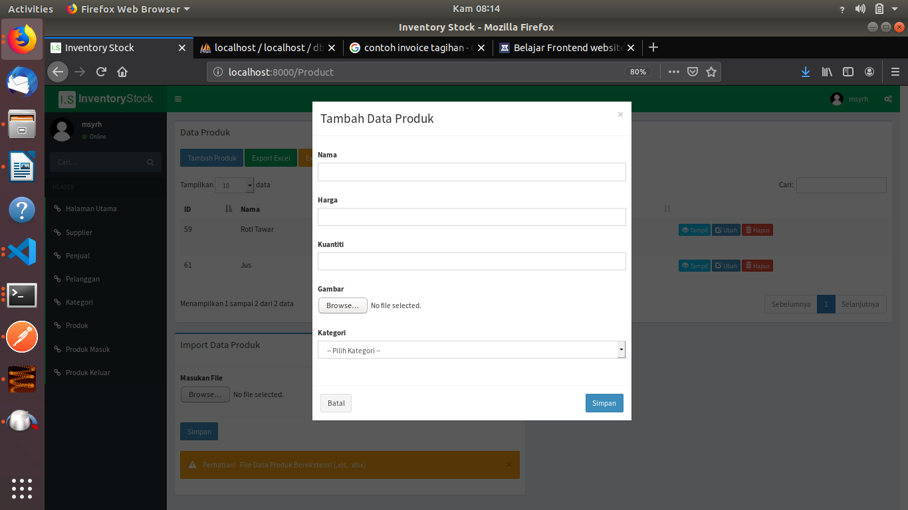
      
    <li>Halaman Ubah Data Produk</li>
     
    
      
    <li>Halaman Data Produk Masuk</li>
     
    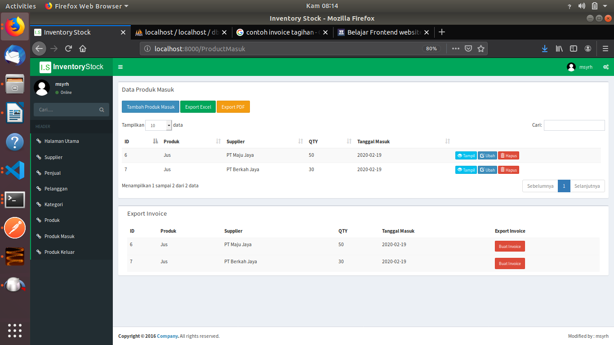
      
    <li>Halaman Tambah Data Produk Masuk</li>
     
    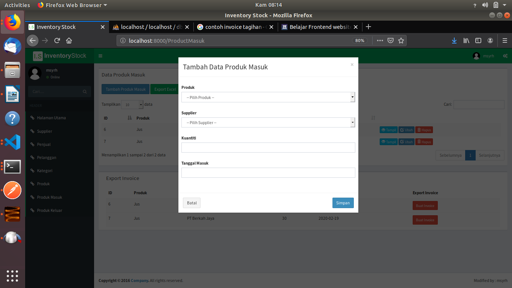
      
    <li>Halaman Ubah Data Produk Masuk</li>
     
    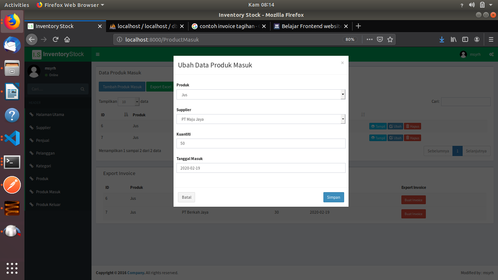
      
    <li>Invoice Produk Masuk</li>
     
    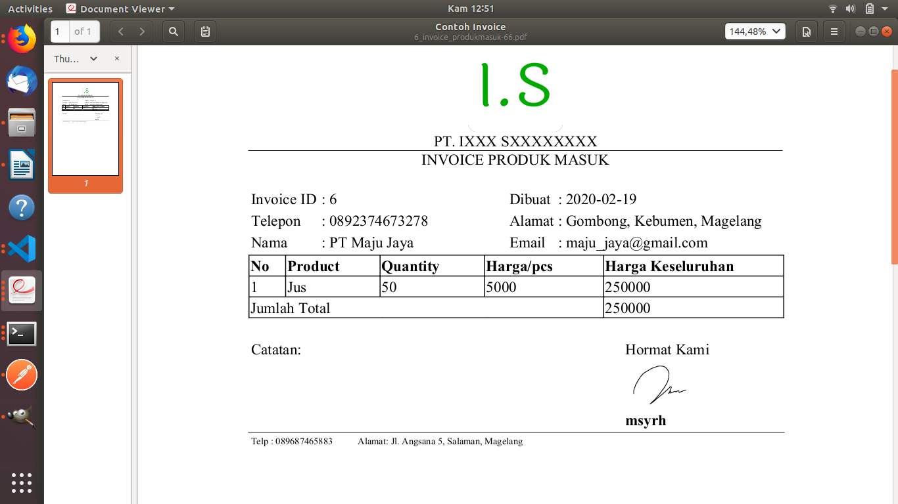
     
</ul>

<h3>Installasi dan Penggunaan</h3>
<ul>
    <li>Install Xampp [skip jika sudah]</li>
    <li>Install Composer [skip jika sudah]</li>
</ul>
<b>Pastikan posisi Berada Terminal/CMD di htdocs Xampp dengan perintah <i>cd</i></b>
<ul>
    <li>Install Laravel
        <pre>
            <code>composer create-project --prefer-dist laravel/laravel inventory</code>
        </pre>
    </li>
    <li>Install Require Yajra Datatables
        <pre>
            <code>composer require yajra/laravel-datatables-oracle</code>
        </pre>
        Lakukan konfigurasi di folde config/app.php
        <pre>
            <code>
                'providers' => [
                    Yajra\Datatables\DatatablesServiceProvider::class,
                ],

                'aliases' => [
                    'Datatables'=>Yajra\Datatables\Facades\Datatables::class,
                ],
            </code>
        </pre>
    </li>
    <li>Install Require Maatwebsite/excel 
        <pre>
            <code>composer reuquire maatwebsite/excel</code>
        </pre>
        Lakukan konfigurasi di folde config/app.php
        <pre>
            <code>
                'providers' => [
                    Maatwebsite\Excel\ExcelServiceProvider::class,
                ],

                'aliases' => [
                    'Excel'=>Maatwebsite\Excel\Facades\Excel::class,
                ],
            </code>
        </pre>
    </li>
    <li>Install Require Barryvdh/laravel-dompdf
        <pre>
            <code>composer require barryvdh/laravel-dompdf </code>
        </pre>
        Lakukan konfigurasi di folde config/app.php
        <pre>
            <code>
                'providers' => [
                    Barryvdh\DomPDF\ServiceProvider::class,
                ],

                'aliases' => [
                    'PDF'=>Barryvdh\DomPDF\Facade::class,
                ],
            </code>
        </pre>
    </li>
    <li>Cara 1: Mengkoding program dengan mengetik ulang program mulai dari folder Routes/web.php, resources/Views, App/http/controller, App/imports, App/exports ( sangat disarankan) hehe</li>
    <li>Cara 2: Melakukan CoPas semua folder ke Project laravel yang sudah diunduh, dengan syarat versi laravel/package sama. <b>Note: Jika melakukan clone, folder vendor laravel hasil clone tidak ada (karena size file besar)</b>, Jadi silahkan folder vendor ditambahkan / Copas dari laravel yang telah anda buat</li>
</ul>

<b>Note :</b> Data screenshote merupakan sample, jika terdapat kesamaan nama atau tempat, silahkan konfirmasi sehingga akan segera saya tarik/ganti

<h3>Semoga Bermanfaat, silahkan tanyakan jika terdapat kendala</h3>
</body>